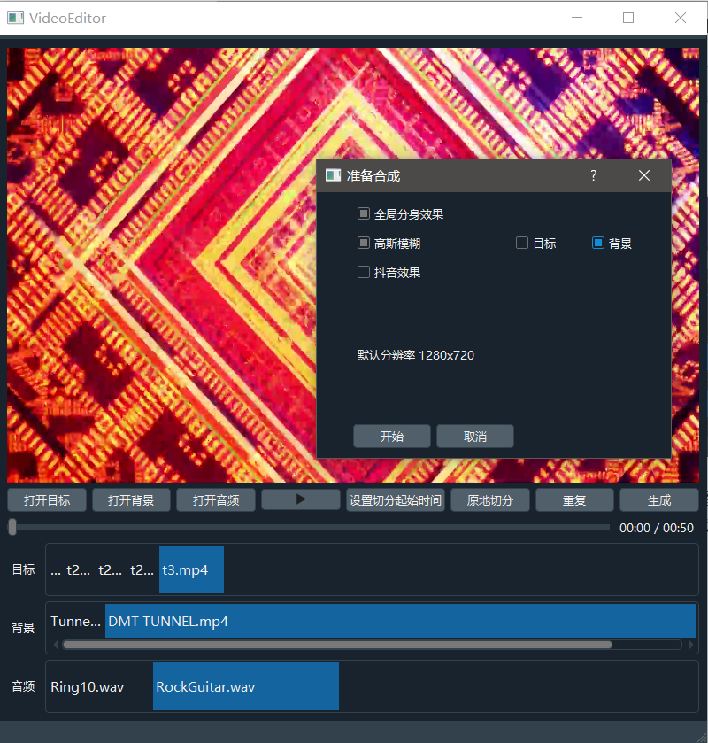

本应用基于 detectron2/PointRend 的模型可将视频中的物体"放"到另一个视频上，并可简单预处理

<a href="https://dl.fbaipublicfiles.com/detectron2/PointRend/InstanceSegmentation/pointrend_rcnn_R_50_FPN_3x_coco/164955410/model_final_3c3198.pkl">模型</a>放到/datasets下

